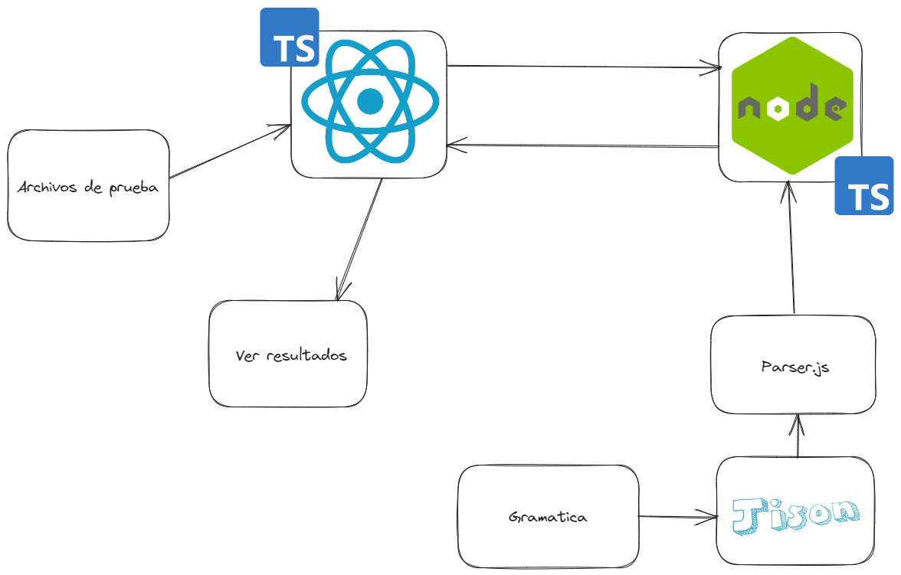

# QueryCrypter
Autor: Melvin Valencia.

Estatus: En progreso.

## Objetivo
Realizar un interprete capaz de reconocer instrucciones SQL y algunas sentencias DDL Y DML.

## Metas
- Crear un editor de texto en React.js.
- Implementar el analizador lexico y sintactico para el lenguaje QueryCrypter.
- Traduccion de las sentencias de delcaraciones logicas y sentencias del lenguaje.
- Ejecutar las instrucciones DDL y DML.
- Reportes de la tabla de simbolos, errores y AST.

## Metas no contempladas
- Generar codigo 3D.
- Hacer la fase de analisis semantico.

## Background
Proyecto del curso Organización de Lenguajes y Compiladores 1,  perteneciente a la Facultad de Ingeniería de la Universidad de San Carlos de Guatemala. 

## Overview
Usando una liberia forntend para recibir los datos y mostrarlos, en el backend usaremos Jison para la traduccion y aqui ejecutaremos toda la logica que sera enviada al frontend.

## Solucion 1
